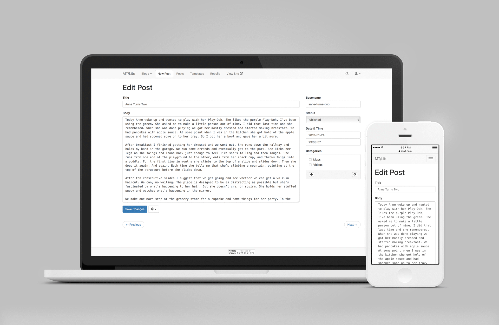

MT/Lite
=======

Movable Type + Bootstrap + jQuery + D3

Installation
------------

1. Add the contents of `mt/alt-tmpl` to MT’s `alt-tmpl` directory.
2. Install jQuery, Bootstrap, and D3 somewhere convenient.
3. Put the contents of `static/mtlite` somewhere convenient.
4. Configure the paths to the static resources in `config.tmpl`.
